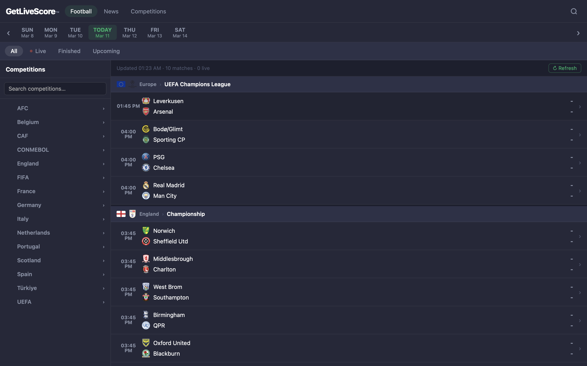
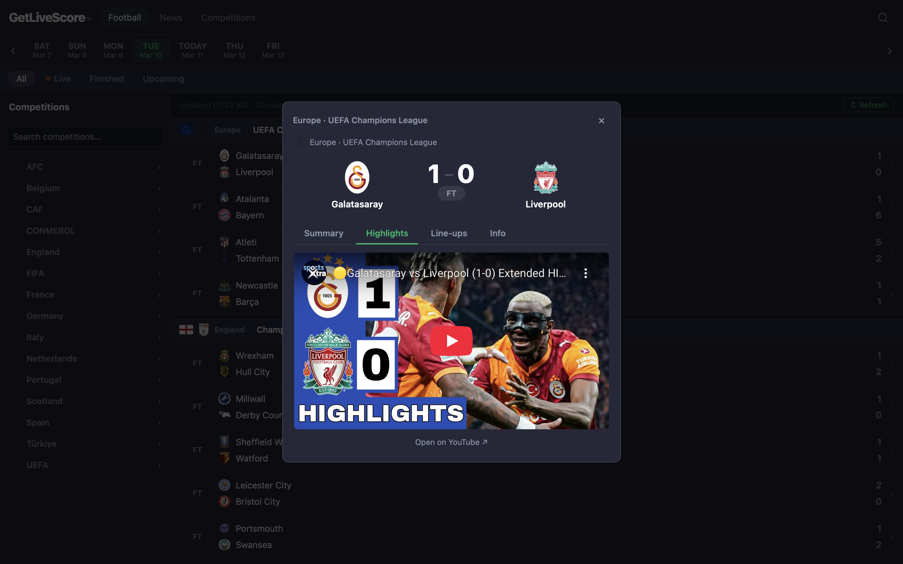

# GetLiveScore™

> A dedicated football scores platform — a lightweight, football-only alternative to LiveScore, built with vanilla JavaScript.

## Screenshots

| Fixtures View | Match Highlights |
|---|---|
|  |  |

---

## Overview

GetLiveScore is a browser-based football scores web application that provides real-time fixtures, results, league standings, top scorers, team pages, and match highlights across 30+ competitions worldwide. It is built entirely with HTML, CSS, and vanilla JavaScript — no frameworks, no build tools.

---

## Features

- **Live & Scheduled Fixtures** — Browse matches by date with a 7-day date strip. Filter by All, Live, Finished, or Upcoming.
- **30+ Competitions** — Covers major leagues (Premier League, La Liga, Bundesliga, Serie A, Ligue 1), UEFA competitions (Champions League, Europa League, Conference League), domestic cups (FA Cup, Copa del Rey, DFB Pokal, Coppa Italia, Coupe de France), international tournaments (World Cup 2026, Euros, Copa América, AFCON, AFC Asian Cup), and more.
- **Match Details Modal** — Click any fixture to view:
  - **Summary** — Goals, scorers, assists, and cards in chronological order
  - **Highlights** — Embedded YouTube highlights (finished matches only)
  - **Line-ups** — Starting XI and substitutes per team
  - **Info** — Date, kick-off time, venue, and referee
- **League Table & Top Scorers** — Click any league header to view the full standings table and top 20 goalscorers
- **Top Leagues Page** — Browse all teams in a competition with official crests and stadium names
- **Sidebar Competition Browser** — Searchable, grouped by country, with jump-to-next-match navigation
- **Football News** — Latest headlines from BBC Sport, Sky Sports, and The Guardian via RSS feeds
- **Auto Refresh** — Live scores refresh every 60 seconds automatically
- **Responsive Design** — Works on desktop, tablet, and mobile with a slide-in sidebar

---

## Tech Stack

| Layer | Technology |
|---|---|
| Frontend | HTML5, CSS3, Vanilla JavaScript (ES2020+) |
| Scores API | [football-data.org](https://football-data.org) v4 (free tier) |
| Highlights | YouTube Data API v3 |
| News | BBC Sport / Sky Sports / The Guardian RSS feeds |
| CORS Proxy | corsproxy.io / allorigins.win |
| Hosting | Any static host (Live Server, GitHub Pages, Netlify) |

---

## Getting Started

### Prerequisites

- A free API token from [football-data.org](https://www.football-data.org) — register and copy your token
- A free YouTube Data API v3 key from [Google Cloud Console](https://console.cloud.google.com) *(optional — only needed for highlights)*

### Setup

1. **Clone the repository**
   ```bash
   git clone https://github.com/yourusername/getlivescore.git
   cd getlivescore
   ```

2. **Add your API keys** in `script.js`:
   ```js
   const FD_TOKEN = 'your_football_data_token_here';
   const YT_KEY   = 'your_youtube_api_key_here';
   ```

3. **Open with Live Server**
   - Install the [Live Server extension](https://marketplace.visualstudio.com/items?itemName=ritwickdey.LiveServer) in VS Code
   - Right-click `index.html` → **Open with Live Server**
   - The app runs at `http://127.0.0.1:5500`

   > ⚠️ Do **not** open `index.html` by double-clicking it. The API requires the page to be served over `http://` — opening via `file://` will block requests.

---

## Project Structure

```
getlivescore/
├── index.html      # App shell — navigation, layout, modal, news and league pages
├── styles.css      # All styles — dark theme, responsive layout, components
└── script.js       # All logic — API calls, rendering, state, events
```

---

## API Usage & Limits

### football-data.org (Free Tier)
- **10 requests/minute**, **no daily cap**
- Competitions included on free tier: `PL, PD, BL1, SA, FL1, CL, WC, DED, ELC, PPL, EC, FAC`
- Competitions on paid tier only (static fallback used): Copa del Rey, DFB Pokal, Coppa Italia, Coupe de France, Super Lig, Belgian Pro League, Scottish Premiership

### YouTube Data API v3 (Free Tier)
- **10,000 units/day** — each highlight search costs ~100 units (~100 searches/day)
- Only triggered on finished matches when the Highlights tab is clicked
- Results are cached for 24 hours to reduce API usage

### RSS News Feeds (No API key required)
- BBC Sport, Sky Sports, The Guardian — all free public RSS
- Cached for 5 minutes per source

---

## Competitions Covered

| Region | Competitions |
|---|---|
| England | Premier League, Championship, FA Cup, Carabao Cup |
| Spain | La Liga, Copa del Rey |
| Germany | Bundesliga, DFB Pokal |
| Italy | Serie A, Coppa Italia |
| France | Ligue 1, Coupe de France |
| Netherlands | Eredivisie, KNVB Cup |
| Portugal | Primeira Liga, Taça de Portugal |
| Scotland | Premiership, Scottish Cup |
| Belgium | Belgian Pro League, Belgian Cup |
| Türkiye | Süper Lig, Turkish Cup |
| UEFA | Champions League, Europa League, Conference League, European Championship, Nations League |
| International | FIFA World Cup 2026, Copa América, Africa Cup of Nations, AFC Asian Cup |

---

## Known Limitations

- **Lineups** require a paid football-data.org subscription — the free tier returns empty lineups
- **Live minute-by-minute updates** are limited on the free tier
- Domestic cup competitions (Copa del Rey, DFB Pokal etc.) are not available on the free tier — they fall back to static team data
- Highlight availability depends on YouTube uploads and may not be available for smaller leagues

---

## License

MIT — free to use, modify and distribute.

---

## Acknowledgements

- [football-data.org](https://football-data.org) — football data API
- [YouTube Data API](https://developers.google.com/youtube/v3) — match highlights
- [BBC Sport](https://www.bbc.co.uk/sport/football), [Sky Sports](https://www.skysports.com), [The Guardian](https://www.theguardian.com/football) — news RSS feeds
- [corsproxy.io](https://corsproxy.io) — CORS proxy for browser API requests
